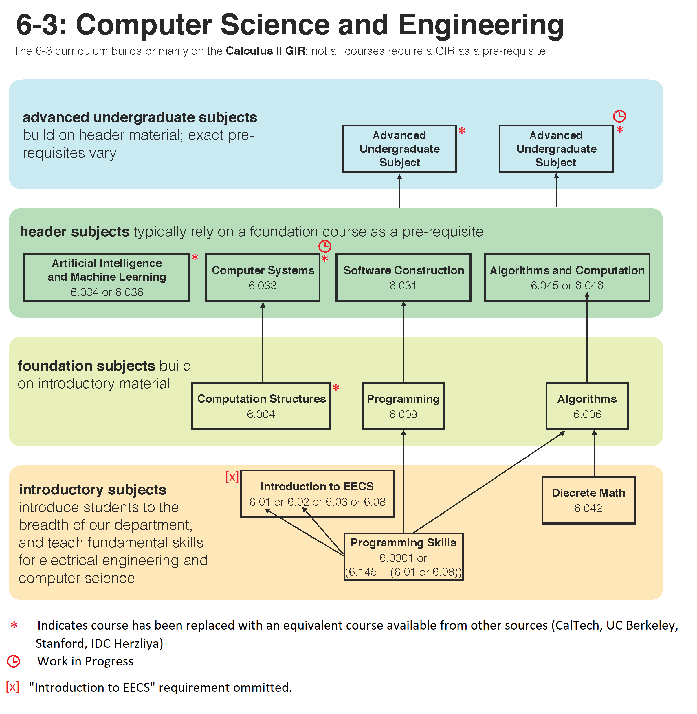

# Open-Source Computer Science Degree

This project documents my personal curriculum of open-sourced University-level courses, available online, that attempt to emulate the breadth and depth of an undergraduate CS degree.  

Initial inspiration came from [The Open-Source Computer Science Degree](https://github.com/ossu/computer-science) project on GitHub. My primary template was [MIT 6-3 Computer Science Degree Requirements](http://www.eecs.mit.edu/curriculum2017). A majority of requirements were satisfied directly with [MIT Open Courseware](https://ocw.mit.edu/courses/electrical-engineering-and-computer-science/) and, when available, the more interactive versions ported to edX. The remaining requirements were satisfied using courses from other institutions (UC Berkeley, Stanford, CalTech, IDC Herzliya) , typically when the MIT OCW version was incomplete in it's Video Lectures, Homeworks, Tests, or Project Autograders.

### Introductory Subjects

**Programming Skills**

MIT 6.0001: Introduction to Computer Science and Programming in Python

edX port of MIT OCW with Professors Eric Grimson and John Guttag.

Resource Links: [edX MITx: 6.00.1x](https://courses.edx.org/courses/course-v1:MITx+6.00.1x+2T2017_2/course/), [edX MITx: 6.00.2x](https://courses.edx.org/courses/course-v1:=MITx+6.00.2x+3T2017/course/)

>Note: [Equivalent to MIT OCW version](https://ocw.mit.edu/courses/electrical-engineering-and-computer-science/6-0001-introduction-to-computer-science-and-programming-in-python-fall-2016/#course_tabs), but with better support for autograding.

**Discrete Math**

MIT 6.042: Mathematics for Computer Science.

Fall 2010 version with Professor Thomas Leighton.

Resources: [MIT OCW](https://ocw.mit.edu/courses/electrical-engineering-and-computer-science/6-042j-mathematics-for-computer-science-fall-2010/)

### Foundation Subjects

**Computation Structures**

~~MIT 6.004 Computation Structures~~ 

Replaced with From Nand to Tetris: Building a Modern Computer from First Principles.

Coursera version with Professor Shimon Schocken.

Resources: [Nand2Tetris Part 1](https://www.coursera.org/learn/build-a-computer?), [Nand2Tetris Part 2](https://www.coursera.org/learn/nand2tetris2) 

**Programming**

~~MIT 6.009 Fundamentals of Programming~~

Ommitted. Equivalent coverage of material is found in MIT 6.031: Software Construction

**Algorithms**

MIT 6.0042: Mathematics for Computer Science.

Fall 2011 version with Professors Erik Demaine and Srini Devadas.

Resources: [MIT OCW](https://ocw.mit.edu/courses/electrical-engineering-and-computer-science/6-006-introduction-to-algorithms-fall-2011/)

### Header Subjects

**Artificial Intelligence and Machine Learning**

~~MIT 6.034: Artificial Intelligence~~

Replaced with UC Berkeley CS 188: Introduction to Artificial Intelligence

Fall 2018 version with Professors Peter Aibeel and Daniel Klein.

Resources: [CS 188 Fall 2018 Course Website](https://inst.eecs.berkeley.edu/~cs188/fa18/), [General Course Website](http://ai.berkeley.edu/home.html)

**Computer Systems (~50% remaining)**

~~MIT 6.033: Computer Systems~~

Replaced with UC Berkeley CS 162: Operating Systems and Systems Programming

Composite set of resources used between Spring 2019 course website and archived Spring 2015 lectures. 
Taught by Professor John Kubiatowicz

Resources: [CS 162 Spring 2019 Course Website](https://cs162.eecs.berkeley.edu/), [Spring 2015 Lectures archived at InfoCoBuild](http://www.infocobuild.com/education/audio-video-courses/computer-science/cs162-spring2015-berkeley.html)

**Software Construction**

MIT 6.031: Software Construction

Composite set of resources used between course website and edX versions. Taught by Professor Robert Miller

Resources: [Course Website](http://web.mit.edu/6.031/www/sp19/), [edX Version Part 1](https://courses.edx.org/courses/course-v1:MITx+6.005.1x+3T2016/course/), [edX Version Part 2](https://courses.edx.org/courses/course-v1:MITx+6.005.2x+1T2017/course/) 

**Algorithms and Computation**

MIT 6.046: Design and Analysis of Algorithms

Spring 2015 version with Professors Erik Demaine and Srini Devadas.

Resources: [MIT OCW](https://ocw.mit.edu/courses/electrical-engineering-and-computer-science/6-046j-design-and-analysis-of-algorithms-spring-2015/)

### Advanced Undergraduate Subjects

**Advanced Undergraduate Subject 1 (~50% remaining)**

UC Berkeley CS 162: Introduction to Database Systems.

Composite set of resources used between edX Edge for lectures and quizzes and course for projects and exams. 

Resources: [Course Website](https://www.cs186berkeley.net/), [edX Edge](https://edge.edx.org/courses/course-v1:EdgeBerkeley+CS186+2019_SP/course/)

**Advanced Undergraduate Subject 2 (~50% remaining)**

Stanford CS 144: Introduction to Computer Networking

Fall 2010 version with Professor Phillip Levis and Nick McKeown

Composite set of resources used between edX/Laguinta for lectures and quizzes and course website for projects and exams.

Resources: [Course Website](http://www.scs.stanford.edu/10au-cs144/), [edX Edge](https://edge.edx.org/courses/course-v1:EdgeBerkeley+CS186+2019_SP/course/), [edX / Stanford Lagunita](https://lagunita.stanford.edu/courses/Engineering/Networking-SP/SelfPaced/about)

**Advanced Undergraduate Subject 3**

CalTech CS 156: Learning Systems (Machine Learning)

Spring 2012 version with Professor Yaser Abu-Mostafa

Resources: [Open Sourced Course Website](https://work.caltech.edu/telecourse.html)
